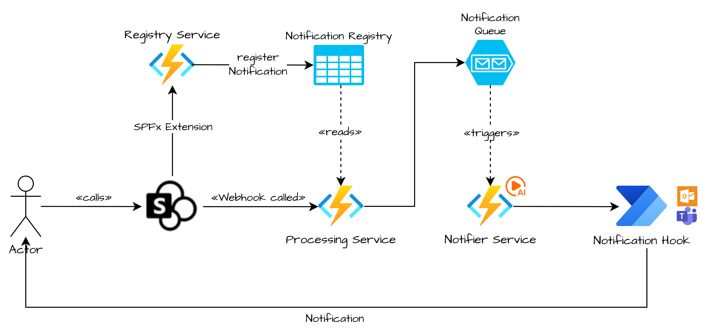

# SharePoint Notifications

> [!WARNING]  
> THIS CODE IS PROVIDED AS IS WITHOUT WARRANTY OF ANY KIND, EITHER EXPRESS OR IMPLIED, INCLUDING ANY IMPLIED WARRANTIES OF FITNESS FOR A PARTICULAR PURPOSE, MERCHANTABILITY, OR NON-INFRINGEMENT.

## Introduction

This is a SharePoint solution built as part of the 2026 SharePoint 25th Hackathon. [Learn more](https://aka.ms/SPat25/Hackathon)

Microsoft recently announced the [retirement of "Alerts"](https://support.microsoft.com/en-us/office/sharepoint-alerts-retirement-813a90c7-3ff1-47a9-8a2f-152f48b2486f) – as consultants ourselves, we know just how loved this feature was, and how much headache its retirement has caused.

We decided to build this solution to fill the gap left by the retirement of Alerts, and to add a little bit of AI to this classic feature along the way.

The goal was to make it easy for users to receive notifications when something changes in a library or list without the need for complex configurations in Power Automate, or to feel kneecapped by the unfortunate limitations of rules.

## The Team

It was built by team "The Bishop Team", a team named after [ESPC 2024](https://www.espc.tech) in Stockholm, and some great nights at the bar "[The Bishops Arms](https://www.elite.se/en/restaurants/stockholm/the-bishops-arms/)". 💪


The Bishop Team are:

- [Nishkalank Bezawada - MVP](https://www.linkedin.com/in/nishkalankbezawada)
- [Tobias Maestrini - MVP](https://www.linkedin.com/in/tobiasmaestrini/)
- [Guido Zambarda - MVP](https://www.linkedin.com/in/guidozam/)
- [Dan Toft - MVP](https://www.linkedin.com/in/dan-toft/)

## Architecture

The solution utilizes a combination of SharePoint Framework (SPFx) for the front-end components and several backend services (Azure Functions) for handling notification registration, processing, AI assisted summarization (Azure AI Foundry) and other business logic. Notifications are delivered to the end user through Power Automate.



### SPFx

For the SPFx front-end, we've leveraged `@spteck/react-controls-v2` UI library (<https://www.npmjs.com/package/@spteck/react-controls-v2>), built by [João Mendes](https://www.linkedin.com/in/joaojosemendes/) to make it easy to build a modern experience! The SPFx extension works on document libraries as well as lists.

### Power Automate

We've decided to use Power Automate to deliver notifications to Micorosft Teams chat or via Email; all resources are bundled in a dedicated solution. This allows us to leverage the existing Microsoft 365 ecosystem, ensuring that notifications are delivered reliably and efficiently with minimal setup for administrators. Alternatively, setting up a Teams bot to deliver the notifications might be an approach worth looking into.

### Azure Functions

TODO

### Azure AI Foundry

TODO (Nishkalank) - We've leveraged Azure Document intelligence to ensure that the users receive a notification that adds value to them

## Installation

### SPFx
In order to install the SharePoint Framework (SPFx) solution (the visual part of the solution), follow these steps:

- Ensure you're running Node.js version 22.x or later.
- Ensure you've got `@rushstack/heft@1.1.7` installed.
- Open the project folder in your terminal, and navigate to the `SPFx` folder.
- Run the following commands
  - `npm install`
  - `heft build`
  - `heft package-solution --production`
- The generated `.sppkg` file can be found in the `sharepoint/solution` folder. This file can be uploaded to your SharePoint App Catalog to deploy the solution.
- **Make sure you globally deploy the package!**
- Navigate to the app catalog site collection and `Site contents`, and find the `Tenant Wide Extensions` list, and update the `Component Properties` with the values from your backend deployment:

```json
{
  "AZURE_FUNCTION_BASE_URL": "https://<backendApiUrl>/api/",
  "AZURE_FUNCTION_CLIENT_ID": "<The client id of the dedicated App Registration for the Azure Function (currently not used)>",
  "AZURE_FUNCTION_KEY": "<function-specific API key is required (see app keys in functions management)>"
}
```